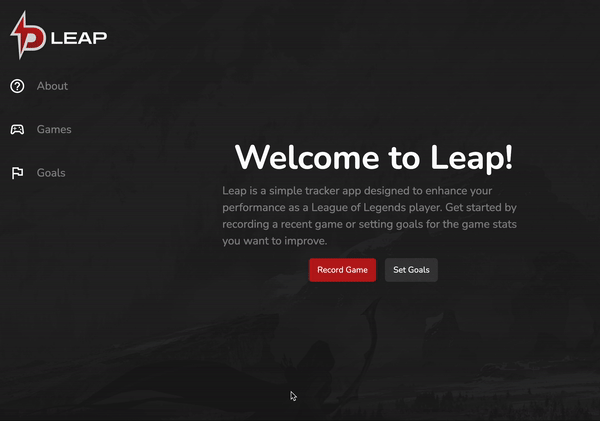

# Leap

Leap is a simple SPA application designed for League of Legend players to keep track of their game performances and set goals.

## Version control

This application is currently hosted publicly on [Github](https://github.com/hellolinz/zlin0379-tracker) for tracking changes and other open source purposes.

## Running the app

Navigate to the folder and use your favourite terminal tool to run this command.

```bash
node server.js
```

After running the command, a live server will be initialised. Type [localhost:8888](http://localhost:8888) in your browser to enter the app.

```bash
App server is running on port 8888
```

## How to use the app

There are 2 major functionalities in this app: adding games and goals.

### Record a game

Use the navigation bar on the left or the buttons in the about page to navigate to games page. Press the "Record Game" button and fill out the form to add a entry of a recent game. By inputting the data, you can keep track of your in-game data such as CS / min, Vision Score and Damage / min.


### Setting a goal

Similar to recording a game, navigate to the goals page and fill out the form. In this function, you can set up to 3 types of goals that you wish to achieve: CS / min, Damage / min and Vision Score. The progress of your goals will be calculated based on your average game statistics.



## Development Process

1. Sketch out improved design iteration
2. Research and set up SPA structure for the app
3. Research and gather resources needed (CSS/JS libraries, images)
4. Start coding HTML
5. Implement Bootstrap classes and CSS styling in a mobile-first approach
6. Building and testing JavaScript functionalities
7. Further testing on local machine and live server
8. Writing comments and documentations
9. Gathering feedbacks from real users

## Iterations

1. Removed the functionality to request for username
2. Revised the overall look and feel of the UI

## Lesson learned

1. How to set up a SPA structure without frameworks like React thanks to [dCode](https://dcode.domenade.com/tutorials/build-a-single-page-app-with-javascript-no-frameworks)
2. How to write everything in vanilla JavaScript (I was a jQuery user)
3. How to use Riot API or fetching an external API in general
4. How asynchronous functions work
5. How to debug and test with Localstorage

## Best practices

1. Set up SPA architecture before jumping into HTML, CSS and JS as it was easier to manage the code piece by piece.
2. To use a formatting and shortcut extension like Prettier and Emmet to speed up your coding process. Learn the shortcuts.

## For future developers

1. Read the comments in the files.
2. `index.html` this is your single HTML markup. Everything else will be handled by JavaScript views under js/views
3. `Games.js` handles games page's output
4. `Goals.js` handles goals page's output
5. `spaRouter.js` handles all the routing of the SPA
6. `scripts.js` your custom script goes here

### Recommendation

1. Edit function implementation
2. Integrate live player data with Riot API

## Acknowledgement

#### Open source libraries

- [Bootstrap 5](https://getbootstrap.com/)
- [BVSelect](https://github.com/BMSVieira/BVSelect-VanillaJS)
- [Datadragon (Riot API)](https://developer.riotgames.com/docs/lol)
- [SPA architecture tutorial by dcode](https://dcode.domenade.com/tutorials/build-a-single-page-app-with-javascript-no-frameworks)
- [Node.js](https://nodejs.org/en)
- [Express.js](https://expressjs.com/)

#### Image used

Riot Games. (n.d.). HD wallpaper: League of Legends 3D wallpaper, Runeterra, Ashe, video games [Review of HD wallpaper: League of Legends 3D wallpaper, Runeterra, Ashe, video games]. [https://www.wallpaperflare.com/league-of-legends-3d-wallpaper-runeterra-ashe-video-games-wallpaper-bjd](https://www.wallpaperflare.com/league-of-legends-3d-wallpaper-runeterra-ashe-video-games-wallpaper-bjd)

‌

## License

[MIT](https://choosealicense.com/licenses/mit/)
